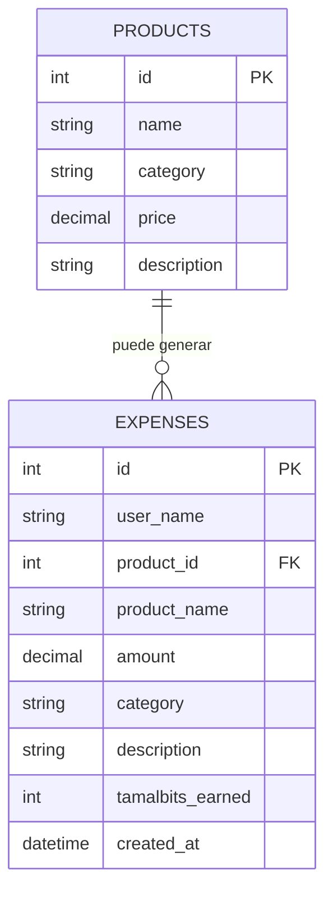

# QZ Store

Aplicacion web sencilla para registrar gastos, consumir una API bancaria externa y acumular Tamalbits.

## Navegacion

- Panel principal con saldo actual, total gastado y Tamalbits.
- Catalogo de productos cargado desde MySQL.
- Formulario para registrar gastos manuales.
- Tabla con historial de movimientos.

## Tecnologia utilizada

- Node.js nativo con `http` y `fetch`.
- MySQL con el driver `mysql2`.
- HTML, CSS y JavaScript vanilla en una sola interfaz.

## Logica principal

- El saldo se consulta siempre desde la API bank.
- Cada gasto valida primero el saldo disponible.
- El descuento de saldo se hace por `POST` hacia la API bank.
- Solo despues de un descuento exitoso se guarda el gasto en MySQL.
- Los Tamalbits se calculan solo para gastos de `Orejas de pollo`, con la regla `1 Tamalbit por cada 10 USD`.

## Variables utiles

- `PORT`: puerto local de la aplicacion. Por defecto `3000`.
- `DB_HOST`: host de MySQL. Por defecto `127.0.0.1`.
- `DB_PORT`: puerto de MySQL. Por defecto `3306`.
- `DB_USER`: usuario de MySQL. Por defecto `root`.
- `DB_PASSWORD`: clave de MySQL.
- `DB_NAME`: nombre de la base de datos. Por defecto `qz_store`.
- `BANK_BASE_URL`: direccion base del servicio bank. Por defecto `http://localhost:8083`.
- `BANK_BALANCE_PATH`: ruta GET para consultar saldo. Por defecto `/api/balance`.
- `BANK_DEBIT_PATH`: ruta POST para descontar saldo. Por defecto `/api/balance/debit`.

## Ejecucion

```bash
npm start
```

Antes de ejecutar, completa tus credenciales en `.env`.

## Tablas usadas

- `products`
- `expenses`

## Modelo entidad-relacion


